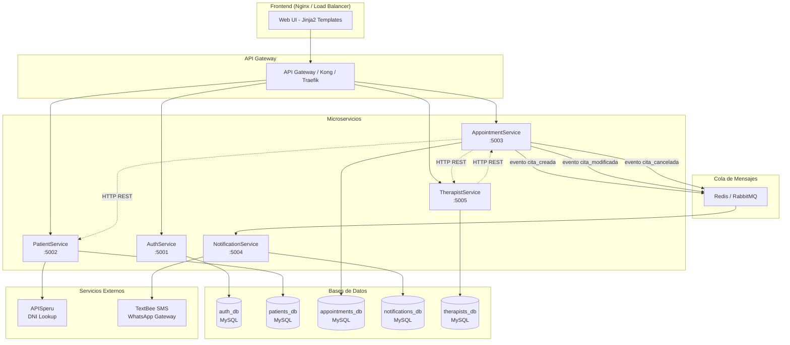
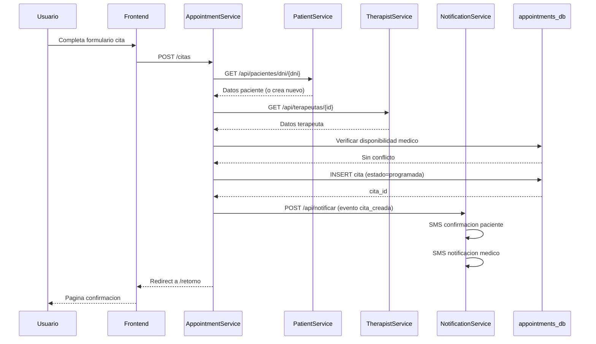
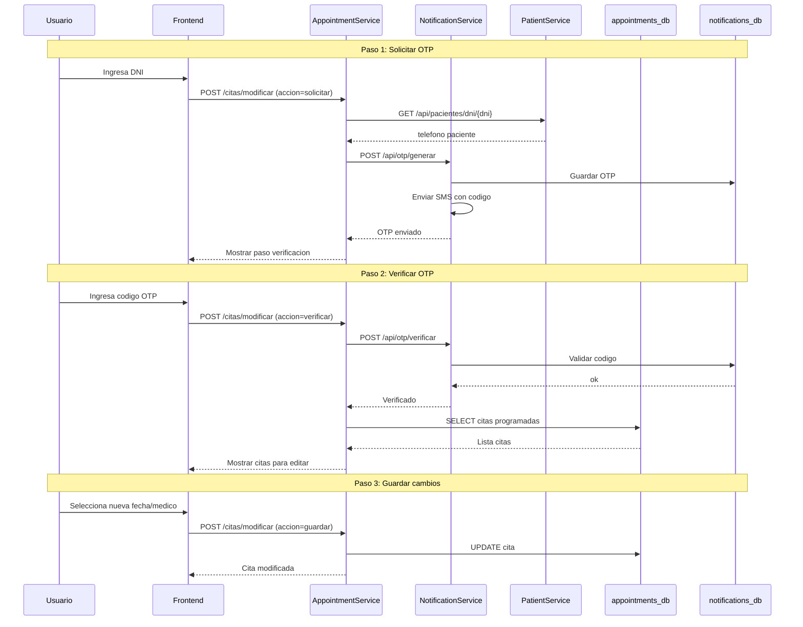
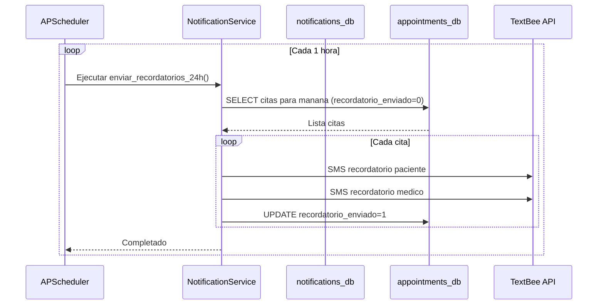
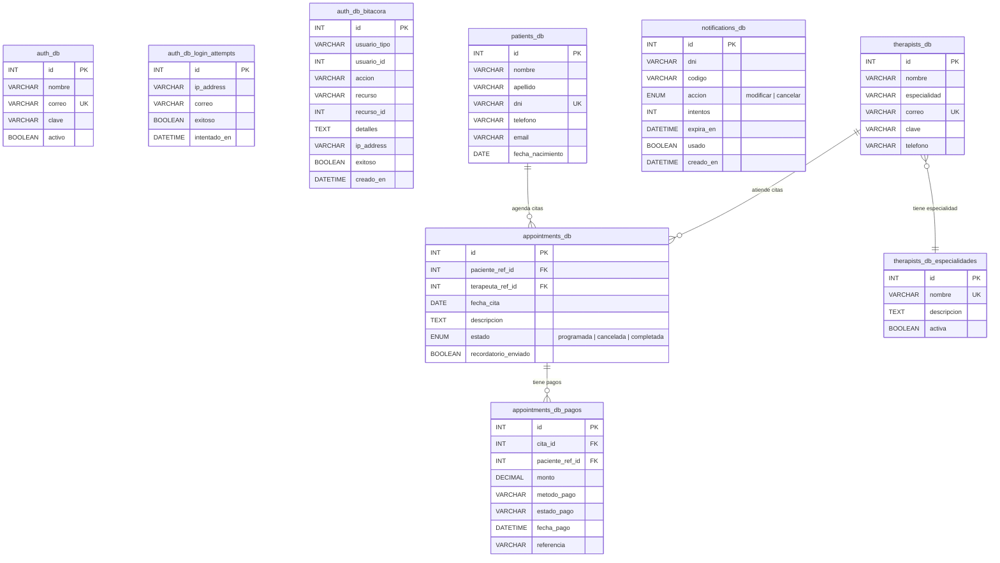
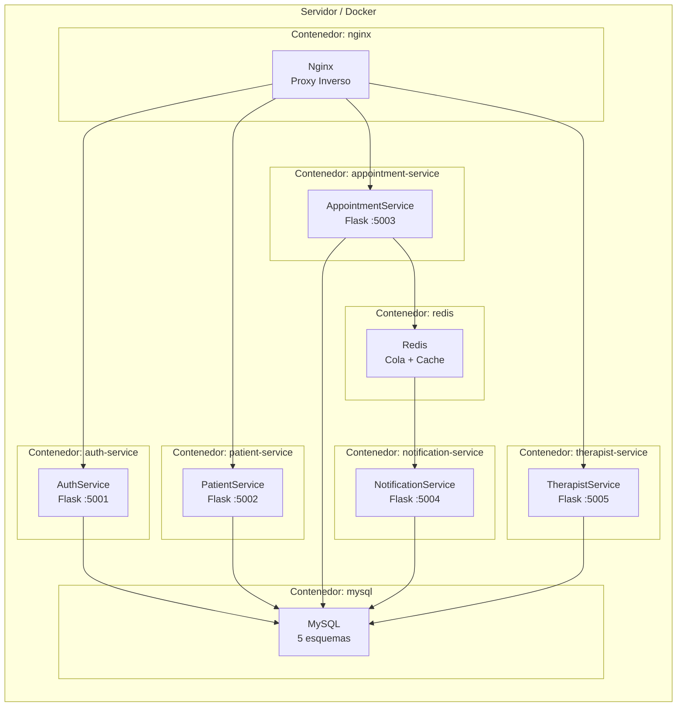

# MOOVA Clinic - Diagramas de Arquitectura

## 1. Diagrama de Arquitectura General (Microservicios)



---

## 2. Diagrama de Flujo - Agendar Cita



---

## 3. Diagrama de Flujo - Modificar Cita (con OTP)



---

## 4. Diagrama de Flujo - Recordatorios 24h



---

## 5. Diagrama de Base de Datos Fragmentada (8 Tablas)



---

## 6. Diagrama de Despliegue



---

## 7. Docker Compose (Referencia)

```yaml
version: '3.8'

services:
  nginx:
    image: nginx:alpine
    ports:
      - "80:80"
    volumes:
      - ./nginx.conf:/etc/nginx/nginx.conf
    depends_on:
      - auth-service
      - patient-service
      - appointment-service
      - therapist-service

  auth-service:
    build: ./services/auth
    ports:
      - "5001:5001"
    env_file: .env
    depends_on:
      - mysql

  patient-service:
    build: ./services/patient
    ports:
      - "5002:5002"
    env_file: .env
    depends_on:
      - mysql

  appointment-service:
    build: ./services/appointment
    ports:
      - "5003:5003"
    env_file: .env
    depends_on:
      - mysql
      - redis
      - patient-service
      - therapist-service

  notification-service:
    build: ./services/notification
    ports:
      - "5004:5004"
    env_file: .env
    depends_on:
      - mysql
      - redis

  therapist-service:
    build: ./services/therapist
    ports:
      - "5005:5005"
    env_file: .env
    depends_on:
      - mysql
      - appointment-service

  redis:
    image: redis:7-alpine
    ports:
      - "6379:6379"

  mysql:
    image: mysql:8.0
    ports:
      - "3306:3306"
    environment:
      MYSQL_ROOT_PASSWORD: ${DB_PASSWORD}
    volumes:
      - ./sql/init:/docker-entrypoint-initdb.d
```
